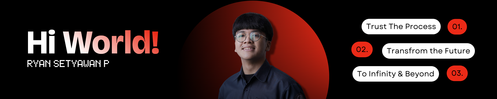

<table>
  <tr>
    <td>
      <h1>Welcome to My Profile! </h1>
      
   📠Studying at <a href="https://www.xmu.edu.my/"><b>Xiamen University Malaysia</b></a>  
            📚 Bachelor of Engineering in <b>Software Engineering</b>  
            🯠Goals: <b>Full Stack Developer</b>   
      
  
            Matthew 6:34: "Therefore do not worry about tomorrow, for tomorrow will worry about itself. Each day has enough trouble of its own."
      

            
      

    </td>
    <td>
      
    </td>
  </tr>
</table>

<picture>
  <source media="(prefers-color-scheme: dark)" srcset="https://raw.githubusercontent.com/rayensetyawan/rayensetyawan/output/pacman-contribution-graph-dark.svg">
  <source media="(prefers-color-scheme: light)" srcset="https://raw.githubusercontent.com/rayensetyawan/rayensetyawan/output/pacman-contribution-graph.svg">
  
</picture>

### 💡Skills 

  <!-- HTML -->
  
  <!-- CSS -->
  
  <!-- C -->
  
  <!-- C++ -->
  
  <!-- Javascript -->
  
  <!-- python -->
  
  <!-- php -->
  
  <!-- Bootstrap -->
  
  <!-- MySQL -->
  
  <!-- Figma -->
  

### 🌐Connect With Me 

  <!-- instagram -->
  
  <!-- tiktok -->
  
  <!-- gmail -->
  
  <!-- linkedin -->
  
  <!-- spotify -->
  

 

<table>
  <tr>
    <td>
      
    </td>
    <td>
      <h2> <i>"Failure is the opportunity to begin again more intelligently." </i></h2>
    </td>
  </tr>
</table>

<!-- ### My Github Stats
 -->

<!-- ###

  

###

  

 -->

